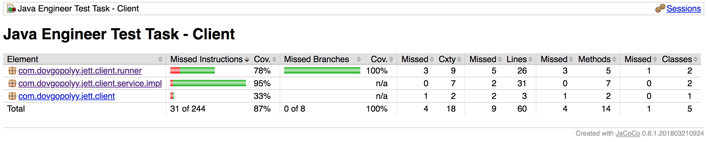
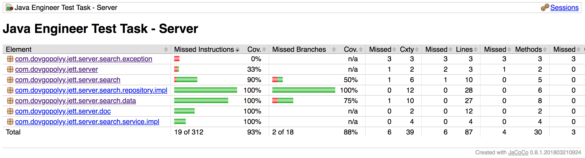
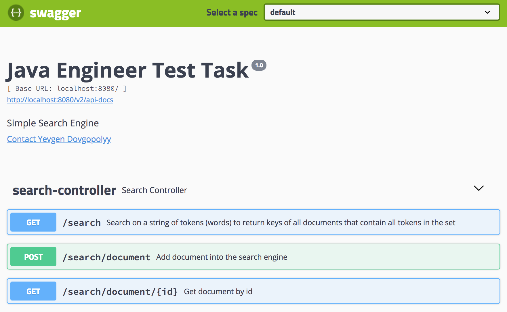

# Java Engineer Test Task

An exercise task to develop a simple search engine using Java with Spring Boot

## Data store
This version is using the H2 in-memory database.

## Getting Started
Clone from github: 

```
> git clone https://github.com/basefx/jett.git
> cd jett
```


### Prerequisites

* Java 8
* Maven 3

### Installing


Fast build:

```
> mvn package -DskipTests=true
```

The result should be:

```
[INFO] Reactor Summary:
[INFO] 
[INFO] Java Engineer Test Task - Parent ................... SUCCESS [  1.419 s]
[INFO] Java Engineer Test Task - Server ................... SUCCESS [  2.844 s]
[INFO] Java Engineer Test Task - Client ................... SUCCESS [  0.714 s]
[INFO] ------------------------------------------------------------------------
[INFO] BUILD SUCCESS
[INFO] ------------------------------------------------------------------------
[INFO] Total time: 5.451 s
```
## Running the tests


To run test:
```
> mvn test jacoco:report
```
## Test coverage
A report could be found in the module target folders:
```
client/target/site/jacoco/index.html
``` 

```
server/target/site/jacoco/index.html
``` 

### Break down into end to end tests

The project contains two types of tests:

1. Unit tests with MockitoJUnitRunner
e.g.
```
SearchServiceImplTest
ClientServiceImplTest
```
2. End to end tests with SpringRunner 
e.g.
```
ServerEndToEndTest
ClientEndToEndTest
```
## Run Server

```
java -jar server/target/server-1.0-SNAPSHOT.jar

```
Recommended to run it in a separate console
## Web Client 
A web client is implemented using [SpringFox](http://springfox.github.io/springfox/) library to automate API UI creation 

If server runs successfully click the following link to open Swagger UI 
[http://localhost:8080/swagger-ui.html](http://localhost:8080/swagger-ui.html)

API UI Screenshot:



## Run CLI Client
```
java -jar client/target/client-1.0-SNAPSHOT.jar

```
## CLI Client usage
#### Add document
Type command `add` press enter.
Type document with space separated tokens and press enter
The server responded with created document id:
```
Id: 6
```

#### Search document
Type command `search` press enter.
```
Enter Command (add, get, search, end)
search
```
Type a desired tokens space separated
```
Enter search string
lorem ipsum
```
Server responded with result
```
Document: [1,5]
```
Where numbers are document ids with all tokens
#### Exit 
Type command `end` press enter.

## Author

* **Yevgen Dovgopolyy** - *All the work* - [basefx](https://github.com/basefx)

## Acknowledgments

* All commands are given for unix-like systems